# ceph-csi RBD Manifest Generator for OpenShift

Script to generate all Kubernetes manifests required to deploy [ceph-csi](https://github.com/ceph/ceph-csi) RBD on OpenShift, connecting to an external standalone Ceph cluster.

## What It Does

Generates 11 ready-to-apply files from a single command:

| File | Resource |
|------|----------|
| `01-namespace.yaml` | Namespace with privileged pod-security labels |
| `02-csi-config.yaml` | ConfigMaps (cluster connection, KMS, ceph.conf) |
| `03-csi-secret.yaml` | Secret with Ceph user credentials |
| `04-rbac-provisioner.yaml` | ServiceAccount, ClusterRole, ClusterRoleBinding for provisioner |
| `05-rbac-node.yaml` | ServiceAccount, ClusterRole, ClusterRoleBinding for node plugin |
| `06-csidriver.yaml` | CSIDriver registration |
| `07-csi-rbd-controller.yaml` | Deployment with 5 sidecars (provisioner, attacher, resizer, snapshotter, rbdplugin) |
| `08-csi-rbd-node.yaml` | DaemonSet with driver-registrar + rbdplugin |
| `09-storageclass.yaml` | StorageClass for general workloads (RWO, filesystem, default) |
| `10-storageclass-vms.yaml` | StorageClass for VMs (RWX Block - live migration) |
| `11-apply-scc.sh` | Helper script to apply required OpenShift SCCs |

## Prerequisites

**On the Ceph side:**

- Ceph cluster bootstrapped (standalone or multi-node)
- RBD pool(s) created (e.g., `openshift`, `openshift-vms`)
- Ceph user created with RBD permissions:
  ```bash
  ceph auth get-or-create client.openshift \
    mon 'profile rbd' \
    osd 'profile rbd pool=openshift, profile rbd pool=openshift-vms'
  ```

**On the OpenShift side:**

- `oc` CLI configured and logged in
- Cluster-admin privileges

## Usage

### Interactive (collects FSID and key via SSH)

```bash
chmod +x generate-ceph-csi-manifests.sh
./generate-ceph-csi-manifests.sh
```

If SSH to the Ceph VM fails, the script prompts for manual input.

### Fully Automated (no SSH, no prompts)

```bash
export CEPH_FSID="92a9e476-045d-11f1-8a0f-005056b0413f"
export CEPH_USER_KEY="AQBxK2FnmFEBBBAAxxxxxxxxxxxxxxxxxxxxxxxx=="
export CEPH_MON_IP="10.X.X.X"
./generate-ceph-csi-manifests.sh
```

### Apply to OpenShift

```bash
# 1. Apply all manifests
oc apply -f ./ceph-csi-manifests/

# 2. Apply SCCs (required on OpenShift)
./ceph-csi-manifests/11-apply-scc.sh

# 3. Verify
oc get pods -n openshift-storage
oc get sc
```

## Environment Variables

All configuration can be overridden via environment variables. Unset variables use the defaults shown below.

| Variable | Default | Description |
|----------|---------|-------------|
| `CEPH_VM` | `ceph-standalone` | Hostname or IP for SSH access to the Ceph VM |
| `CEPH_MON_IP` | `10.X.X.X` | Ceph MON IP address |
| `CEPH_FSID` | *(collected via SSH)* | Ceph cluster FSID - skips SSH if set |
| `CEPH_USER_KEY` | *(collected via SSH)* | Key for `client.openshift` - skips SSH if set |
| `CSI_VERSION` | `v3.13.0` | ceph-csi container image tag |
| `OUTPUT_DIR` | `./ceph-csi-manifests` | Directory for generated manifests |
| `POOL_GENERAL` | `openshift` | RBD pool for general workloads (StorageClass `ceph-rbd`) |
| `POOL_VMS` | `openshift-vms` | RBD pool for VMs (StorageClass `ceph-rbd-virtualization`) |

> **Tip:** When both `CEPH_FSID` and `CEPH_USER_KEY` are set, the script requires no SSH access and no user interaction - ideal for CI/CD pipelines.

## Architecture

```mermaid
graph TD
    subgraph OpenShift["OpenShift Cluster"]
        controller["csi-rbd controller\n(Deployment, 2 replicas)"]
        node["csi-rbd node\n(DaemonSet, per worker)"]
    end

    subgraph CephVM["Ceph VM (standalone)"]
        mon["MON + MGR"]
        osd["OSD × 3"]
        pool["Pools: openshift, openshift-vms"]
    end

    controller -- "RADOS\n6789 / 3300" --> mon
    node -- "RADOS\n6789 / 3300" --> mon
    mon --- osd
    osd --- pool
```



## StorageClasses Created

| Name | Access Mode | Volume Mode | Pool | Use Case |
|------|-------------|-------------|------|----------|
| `ceph-rbd` (default) | RWO | Filesystem | `openshift` | General workloads, etcd, databases |
| `ceph-rbd-virtualization` | RWX | Block | `openshift-vms` | VM disks, live migration |

To use the VM StorageClass, create PVCs with:

```yaml
accessModes:
  - ReadWriteMany
volumeMode: Block
```

## Verification

After applying, confirm everything is running:

```bash
# Pods should show Running (2 provisioner + 1 node per worker)
oc get pods -n openshift-storage

# Both StorageClasses should exist
oc get sc

# Test with a PVC
cat <<EOF | oc apply -f -
apiVersion: v1
kind: PersistentVolumeClaim
metadata:
  name: test-ceph-rbd
spec:
  accessModes:
    - ReadWriteOnce
  resources:
    requests:
      storage: 1Gi
  storageClassName: ceph-rbd
EOF

# Should transition to Bound
oc get pvc test-ceph-rbd

# Cleanup
oc delete pvc test-ceph-rbd
```

## Troubleshooting

**PVC stuck in Pending:**
```bash
oc describe pvc <name>
oc logs -n openshift-storage deploy/csi-rbdplugin-provisioner -c csi-rbdplugin
```

**Node plugin CrashLoopBackOff:**
```bash
# Check if SCCs were applied
oc get scc privileged -o yaml | grep openshift-storage
# Re-apply if missing
./ceph-csi-manifests/11-apply-scc.sh
```

**Connectivity to Ceph:**
```bash
# From any OpenShift node, test MON port
oc debug node/<node-name> -- chroot /host curl -s telnet://<CEPH_MON_IP>:6789
```

**Ceph health:**
```bash
# On the Ceph VM
ceph -s
ceph osd pool ls detail
ceph auth get client.openshift
```

## Compatibility

| Component | Tested Version |
|-----------|----------------|
| OpenShift | 4.17 - 4.20 |
| Ceph | RHCS 8 (Squid), Community Reef/Squid |
| ceph-csi | v3.12.x - v3.13.x |
| RHEL (Ceph VM) | 9.x, 10.x |

## License

MIT
